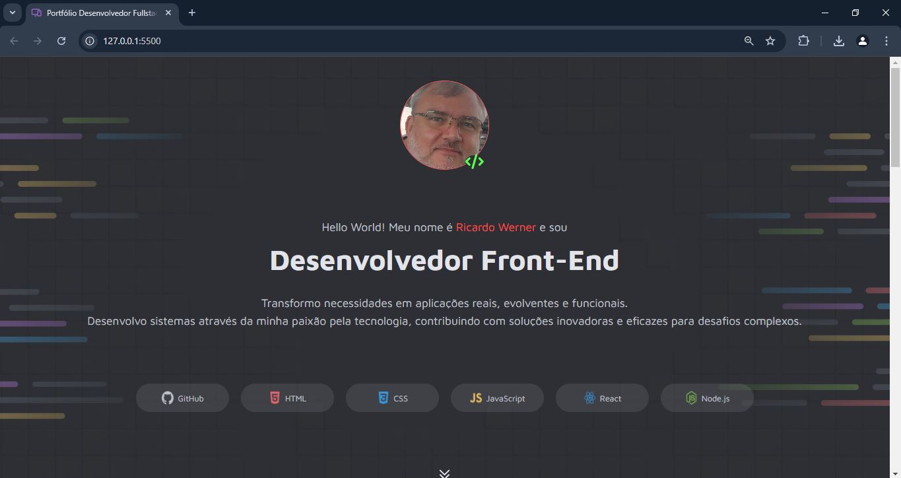
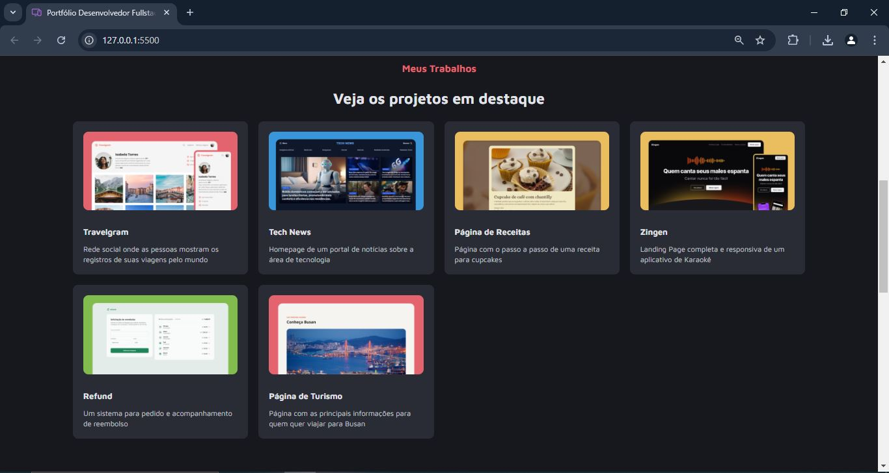
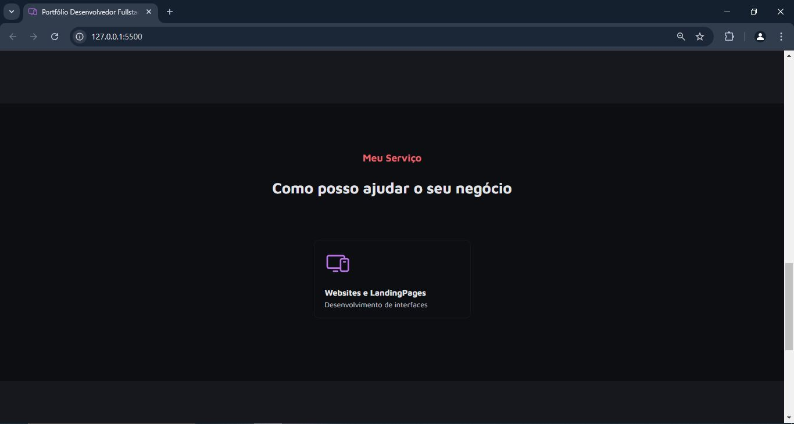
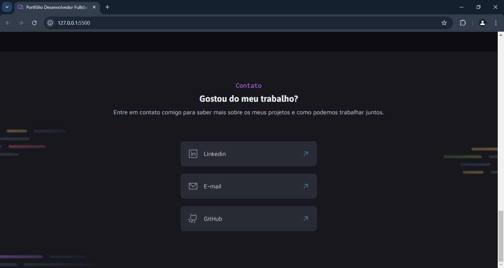
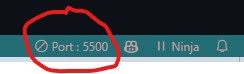
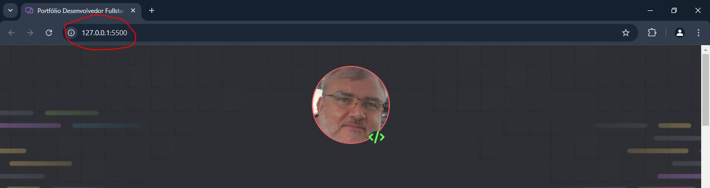

# Portifólio Desenvolvedor Front-End

Desafio prático pra desenvolver uma página de protifólio para desenvolvedores, com links para projetos e contato profissional.

## Página estática de Portifólio DEV pessoal 

### 📜 Sobre o Projeto

Este projeto consiste em uma aplicação web para criptografia e descriptografia de textos, permitindo a troca de mensagens seguras entre usuários que conhecem a chave de criptografia utilizada.

### 🔗 Links Úteis

- 
- 

### ✅ Status do Projeto

**Concluído**

### 🎥 Demonstração

#### Tela inicial

  

#### Tela de projetos

  

#### Tela de serviços

  

#### Tela de contatos

  

### 🧩 Desafio

O desafio proposto neste projeto foi criar uma aplicação que criptografa textos, permitindo a troca de mensagens secretas entre usuários que conhecem a chave de criptografia utilizada.

### 📝 Requisitos da Aplicação

| Item  | Descrição                                                                 |
|-------|---------------------------------------------------------------------------|
|  1    | A página deve ser desenvolvida em HTML, CSS.                              |
|  2    | A página deve seguir os design do Figma.                                  |
|  3    | Modelagem do layout, formatos, tipografias, cores e organização no Figma. |
|  3.1  | Opcional: Modelagem de modo livre.                                        |

### 🚀 Plano do Projeto

No desenvolvimento desta aplicação, foram aplicados os seguintes conceitos:

| Item  | Descrição                                   |
|-------|---------------------------------------------|
|  1    | HTML                                        |
|  2    | CSS                                         |
|  3    | Prototipagem (Figma)                        |

### 🛠 Tecnologias Utilizadas

- **Visual Studio Code**
- **HTML**
- **CSS**
- **Documentação**
- **ChatGpt**

### 💡 Reflexões

Desenvolver este projeto foi mais um passo no meu desenvolvimento na arte da programação, proporcionando um aprofundamento nas práticas de desenvolvimento web. Foi possível explorar a flexibilidade do HTML e organização do CSS, além de desenvolver sobre a importância de uma estruturação inteligente para facilitar a manutenção futura das aplicações.

### 📦 Como Executar o Projeto

1. Clone o repositório:
   
   git clone https://github.com/ricardo-werner/Rocketseat_FullStack_Desafio_Pratico_Portifolio_Dev.git

3. Abra o projeto no Visual Studio Code e ative o Go Live:
    
   

     
   

   

     
   

4. Visualize o resultado na página web:

   

     
   

### 🙋‍♂️ Autor
Ricardo Werner 
Dev em Desenvolvimento

